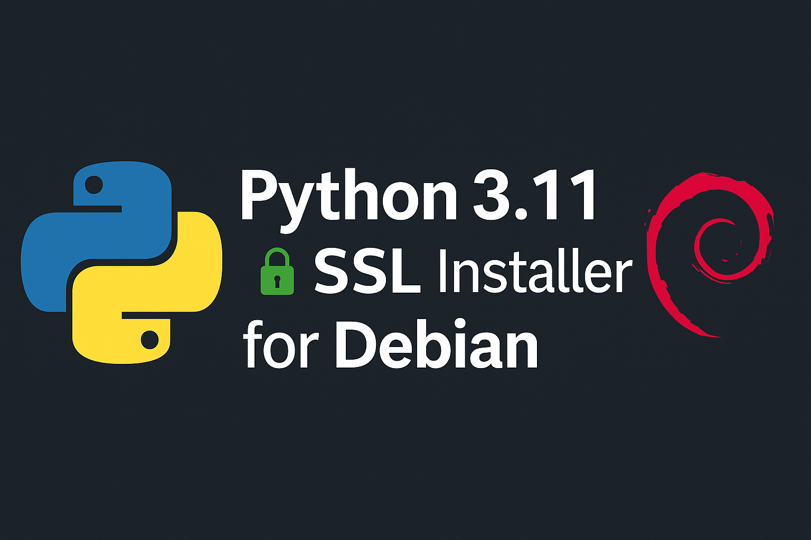

<p align="center">
  
</p>

# 🐍 Python 3.11 Installer with OpenSSL (Debian Buster)

[](https://opensource.org/licenses/MIT)

-red)
[](https://github.com/tribecabrasil/-python-3.11-openssl-installer/archive/refs/heads/main.zip)

> Installs Python 3.11.9 with OpenSSL 1.1.1w under `/opt/python3.11`, fully compatible with Django 5.1+

---

## ✅ Features

- Compiles Python 3.11.9 from source
- Includes OpenSSL 1.1.1w (from source)
- Installs pip and setuptools
- Works on minimal cloud VMs
- Isolated from system Python

---

## 🚀 Install

```bash
git clone https://github.com/tribecabrasil/-python-3.11-openssl-installer.git
cd -python-3.11-openssl-installer
chmod +x install_python_3_11_custom_ssl.sh
sudo ./install_python_3_11_custom_ssl.sh
```

---

## 🔍 Check

```bash
/opt/python3.11/bin/python3.11 --version
/opt/python3.11/bin/python3.11 -m ssl
```

---

## 🌍 Make Available Globally

```bash
sudo ln -s /opt/python3.11/bin/python3.11 /usr/local/bin/python3.11
sudo ln -s /opt/python3.11/bin/pip3.11 /usr/local/bin/pip3.11
```

---

## 📘 Em Português (🇧🇷)

Instalador do Python 3.11.9 com OpenSSL 1.1.1w em `/opt/python3.11`, compatível com Django 5.1+.

---

### ✅ Funcionalidades

- Compilação do Python 3.11.9 com suporte SSL
- OpenSSL incluso (versão 1.1.1w)
- pip e setuptools já instalados
- Funciona em VMs com poucos recursos
- Instalação isolada

---

### 🚀 Instalação

```bash
git clone https://github.com/tribecabrasil/-python-3.11-openssl-installer.git
cd -python-3.11-openssl-installer
chmod +x install_python_3_11_custom_ssl.sh
sudo ./install_python_3_11_custom_ssl.sh
```

---

### 🔍 Verificação

```bash
/opt/python3.11/bin/python3.11 --version
/opt/python3.11/bin/python3.11 -m ssl
```

---

### 🌍 Deixar disponível globalmente

```bash
sudo ln -s /opt/python3.11/bin/python3.11 /usr/local/bin/python3.11
sudo ln -s /opt/python3.11/bin/pip3.11 /usr/local/bin/pip3.11
```

---
